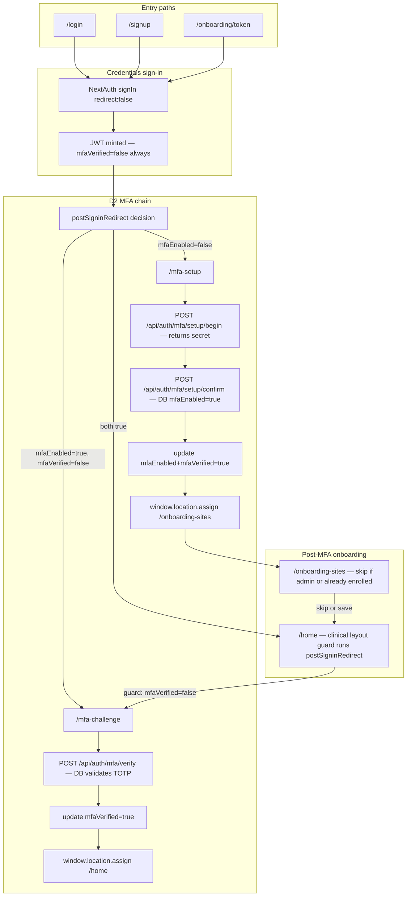

# Sprint 0 — Login & session trust

> **Status:** In progress.
> **Gate rule:** All five verify-script scenarios below must pass on a fresh browser profile before Sprint A begins.
> **Polish checklist reference:** [`context/specs/polish-waves-0-6.md`](polish-waves-0-6.md)

---

## Why this sprint exists

Units 01–37 assumed MFA transitions would be fast enough that a `router.push` immediately after `session.update()` would land on a server render that already sees the updated JWT cookie. In practice the JWT cookie write races the server-side render — the clinical layout receives the **old** token, sees `mfaVerified: false`, and redirects back to `/mfa-challenge`, producing a loop the user cannot break out of without clearing cookies.

Sprint 0 makes the login → MFA → home path unconditionally correct before any Sprint A clinical work depends on it.

---

## Full login → home flow



**Key files**

| Step | File |
|------|------|
| Redirect decision (pure fn) | [`src/lib/post-signin-redirect.ts`](../../src/lib/post-signin-redirect.ts) |
| JWT strategy + `trigger:'update'` | [`src/lib/auth.config.ts`](../../src/lib/auth.config.ts) L117–169 |
| Login client-side redirect | [`src/app/(auth)/login/_components/login-form.tsx`](../../src/app/(auth)/login/_components/login-form.tsx) |
| Signup client-side redirect | [`src/app/(auth)/signup/_components/signup-form.tsx`](../../src/app/(auth)/signup/_components/signup-form.tsx) |
| MFA setup wizard | [`src/app/(auth)/mfa-setup/_components/mfa-setup-wizard.tsx`](../../src/app/(auth)/mfa-setup/_components/mfa-setup-wizard.tsx) |
| MFA setup page (server) | [`src/app/(auth)/mfa-setup/page.tsx`](../../src/app/(auth)/mfa-setup/page.tsx) |
| MFA challenge form | [`src/app/(auth)/mfa-challenge/_components/mfa-challenge-form.tsx`](../../src/app/(auth)/mfa-challenge/_components/mfa-challenge-form.tsx) |
| Onboarding sites page | [`src/app/(auth)/onboarding-sites/page.tsx`](../../src/app/(auth)/onboarding-sites/page.tsx) |
| Clinical layout guard | [`src/app/(clinical)/layout.tsx`](../../src/app/(clinical)/layout.tsx) |
| Admin / owner / ops layout guards | `src/app/(admin|owner|ops)/layout.tsx` |
| Home page (null return bug) | [`src/app/(clinical)/home/page.tsx`](../../src/app/(clinical)/home/page.tsx) L52 |

---

## Bug inventory

### B-01 — JWT cookie propagation race (primary MFA loop) — P0

**Symptom:** Completing MFA challenge (or setup `finish()`) loops back to `/mfa-challenge`.

**Mechanism:**
1. Client calls `await update({ mfaVerified: true })` to patch the JWT.
2. Client immediately calls `router.push('/home')` + `router.refresh()`.
3. Server renders `(clinical)/layout.tsx` before the updated JWT cookie propagates — reads `mfaVerified: false`.
4. Layout redirects back to `/mfa-challenge`. Infinite loop.

**Fix (PR0-1):** Replace soft navigation with `window.location.assign(target)` after `session.update()` in both MFA flows. Hard navigation reloads the page from scratch, guaranteeing the browser sends the updated cookie on the new request. See [`src/lib/auth/complete-mfa-navigation.ts`](../../src/lib/auth/complete-mfa-navigation.ts) (new helper).

### B-02 — Login `getSession()` race — P0

**Symptom:** Returning enrolled user occasionally directed to `/mfa-setup` briefly after sign-in, or `postSigninRedirect` sees stale session data.

**Mechanism:** `login-form.tsx` calls `getSession()` immediately after `signIn('credentials', ...)`. The new JWT cookie may not yet be readable by the time `getSession()` resolves.

**Fix (PR0-2):** Replace the `getSession()` + `router.push` pattern with `window.location.assign(postSigninRedirect(...))` using the same session data already returned inline from `signIn()`, avoiding a second round trip.

### B-03 — MFA setup page re-runs enrollment after mid-wizard refresh — P1

**Symptom:** If the user refreshes between "Verify & enroll" success and clicking "Continue" (i.e., on the recovery codes screen), the page server-renders with the old JWT (`mfaEnabled=false`) and fires `setup/begin` again, generating a new QR code. The user must scan again.

**Mechanism:** `mfa-setup/page.tsx` redirects based on `session.user.mfaEnabled` from JWT only. After confirm the DB has `mfaEnabled=true` but JWT isn't updated until `finish()` calls `update()`.

**Fix (PR0-3):** Server-side `mfa-setup/page.tsx` checks the DB directly when `session.user.mfaEnabled=false`, and if the DB shows `mfaEnabled=true`, redirects to `/mfa-challenge` instead of loading the setup wizard.

### B-04 — `onboarding-sites` has no MFA gate — P1

**Symptom:** A user who reaches `/onboarding-sites` via direct navigation before completing MFA can access this page without `mfaVerified`.

**Mechanism:** [`onboarding-sites/page.tsx`](../../src/app/(auth)/onboarding-sites/page.tsx) checks `session?.user` but does not check `mfaEnabled`/`mfaVerified`.

**Fix (PR0-4):** Add the same two MFA redirect guards present in admin/owner/ops layouts.

### B-05 — Home page returns `null` on missing `orgId`/`orgUserId` — P1

**Symptom:** Blank white page after login when session is partial (e.g., user not yet in an org, or session data corrupted).

**Mechanism:** [`home/page.tsx`](../../src/app/(clinical)/home/page.tsx) L52 returns `null` instead of redirecting.

**Fix (PR0-6):** Replace `return null` with `redirect('/login')`.

### B-06 — Profile completion does not refresh session — P1

**Symptom:** After completing `/onboarding/profile`, the JWT still carries stale `division`/`professionType` until the user re-logs in. "Start visit" may get wrong division.

**Mechanism:** [`profile-form.tsx`](../../src/app/onboarding/profile/_components/profile-form.tsx) calls `router.refresh()` but not `session.update()`. The `trigger:'update'` path in `auth.config.ts` re-fetches the OrgUser from DB — so calling `update()` is the correct fix.

**Fix (PR0-6):** Call `await update()` (no payload needed — the DB re-fetch in `auth.config.ts` picks up the fresh `professionType`/`division`) then hard-navigate to the redirect target.

---

## PR order

### PR0-1 — `completeMfaNavigation` helper (fixes B-01)

**New file:** `src/lib/auth/complete-mfa-navigation.ts`

```typescript
// Call after a successful MFA verify or setup finish.
// Hard navigation guarantees the updated cookie reaches the server
// before the next render — soft navigation (router.push) races the
// JWT cookie write and causes redirect loops in the clinical layout.
export async function completeMfaNavigation(
  update: (data?: Record<string, unknown>) => Promise<unknown>,
  sessionPatch: Record<string, unknown>,
  destination: string,
): Promise<void> {
  await update(sessionPatch);
  window.location.assign(destination);
}
```

**Edit `mfa-challenge-form.tsx`:** replace `await update(...)` + `router.push('/home')` + `router.refresh()` with `completeMfaNavigation(update, { mfaVerified: true }, '/home')`.

**Edit `mfa-setup-wizard.tsx` `finish()`:** replace `await update(...)` + `router.push('/onboarding-sites')` + `router.refresh()` with `completeMfaNavigation(update, { mfaEnabled: true, mfaVerified: true }, '/onboarding-sites')`.

### PR0-2 — Login/signup post-sign-in redirect (fixes B-02)

**Edit `login-form.tsx`:** After `signIn('credentials', { redirect: false })`, read `mfaEnabled`/`mfaVerified` from the `res` callback data if available, or call `getSession()` with a simple 150ms retry (max 3 attempts), then `window.location.assign(target)`.

**Edit `signup-form.tsx`:** Same pattern — check if it calls `getSession()` post-sign-in and apply the same fix.

### PR0-3 — MFA setup DB truth check (fixes B-03)

**Edit `mfa-setup/page.tsx`:** After confirming the user has no session MFA, do a minimal DB read (`prisma.user.findUnique({ where: { id: session.user.id }, select: { mfaEnabled: true } })`). If `db.mfaEnabled=true` redirect to `/mfa-challenge`. This prevents the wizard re-running after a mid-enrollment page refresh.

### PR0-4 — Onboarding-sites MFA gate (fixes B-04)

**Edit `onboarding-sites/page.tsx`:** Add after the auth check:

```typescript
if (!session.user.mfaEnabled) redirect('/mfa-setup');
if (!session.user.mfaVerified) redirect('/mfa-challenge');
```

### PR0-5 — Tests (contract coverage)

**New file:** `test/lib/post-signin-redirect.test.ts`

Three test cases:
1. `mfaEnabled: false` → `/mfa-setup`
2. `mfaEnabled: true, mfaVerified: false` → `/mfa-challenge`
3. `mfaEnabled: true, mfaVerified: true` → `/home`

### PR0-6 — Post-login chain hardening (fixes B-05, B-06 + W0-07)

| Fix | File | Change |
|-----|------|--------|
| Home blank guard | [`home/page.tsx`](../../src/app/(clinical)/home/page.tsx) | `return null` → `redirect('/login')` |
| Profile session refresh | [`profile-form.tsx`](../../src/app/onboarding/profile/_components/profile-form.tsx) | Call `await update()` then hard-navigate |
| Seat gate UX | [`scheduling-card.tsx`](../../src/components/clinical/scheduling-card.tsx) | Surface `no_seat_assigned` error code with human copy |
| README seed accuracy (W0-07) | [`README.md`](../../README.md) | Replace `SUPER_ADMIN` references with `ORG_ADMIN` |

---

## Manual verify script (exit criteria)

Run each scenario on a **fresh browser profile** (no prior cookies). All five must pass before Sprint A starts.

### Scenario 1 — Returning enrolled user

1. Navigate to `/login`
2. Enter `admin@demo.local` + demo password + correct TOTP code
3. Expected: lands on `/home` in one shot, no bounce back to `/mfa-challenge`

### Scenario 2 — New self-serve signup

1. Navigate to `/signup`
2. Complete org creation form
3. Sign in automatically after API returns 201
4. Expected: → `/mfa-setup` → QR scan → enter code → recovery codes → "Continue" → `/onboarding-sites` (or `/home` if skipped) — no loops

### Scenario 3 — Mid-enrollment page refresh

1. Complete `/mfa-setup` through "Verify & enroll" (confirm step)
2. **Before** clicking "Continue" on recovery codes, refresh the browser
3. Expected: page does **not** show a new QR code; shows either the recovery codes again or redirects to `/mfa-challenge`

### Scenario 4 — Invite onboarding path

1. Use a valid invite token at `/onboarding/[token]`
2. Set password → auto sign-in
3. Expected: same as Scenario 2 (MFA setup → recovery codes → onboarding-sites → home)

### Scenario 5 — Re-login next session

1. Sign out from an enrolled account
2. Sign back in with TOTP
3. Expected: challenge once → home (no setup wizard, no loop)

---

## Three-lens evaluation

- **Clinician:** MFA loop blocks the very first action of every session. Fixing cookie sync restores trust in the entry point without changing any clinical workflow.
- **Compliance (Medicare):** D2 always-required MFA is not weakened — we are fixing session propagation, not bypassing verification. Every MFA verify/enroll still writes an audit row.
- **Insurance Auditor:** MFA audit trail (`MFA_ENROLLED`, `MFA_VERIFIED`, `MFA_VERIFY_FAILED`) is unchanged. The fix is invisible to the audit log — it only affects the browser navigation sequence after a successful verification.
