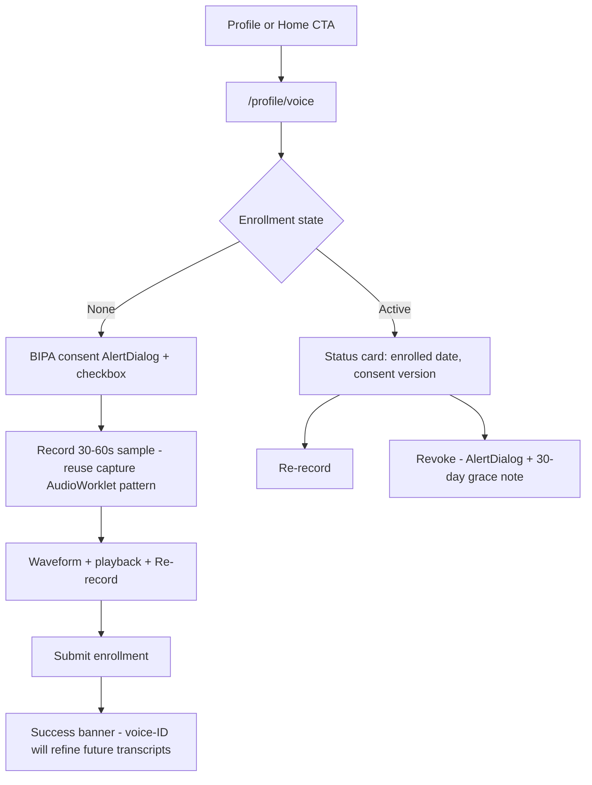
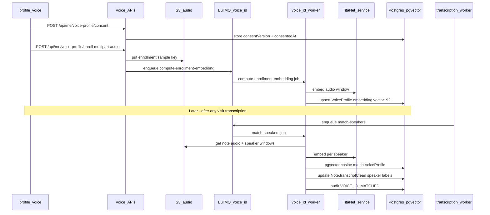
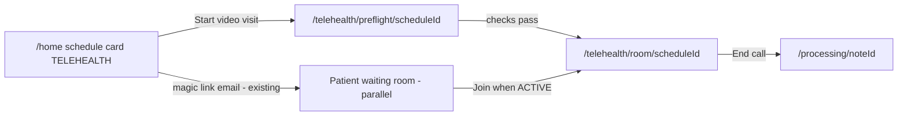
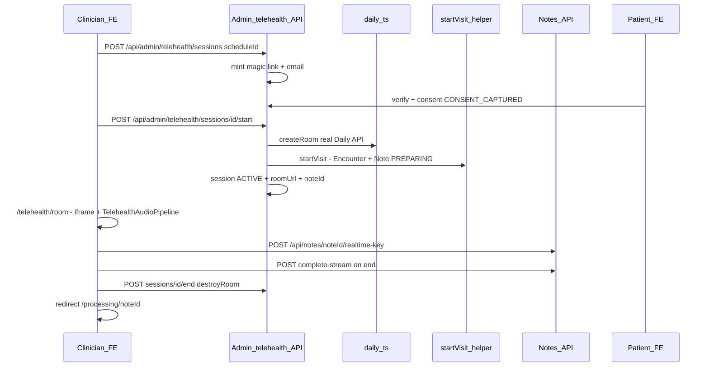
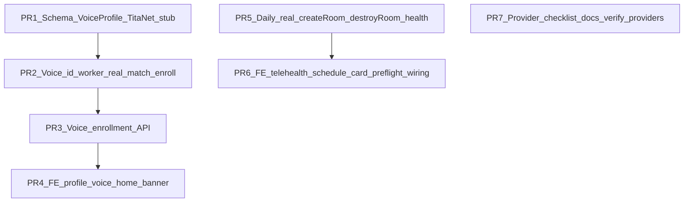

# Sprint A — Frontend surfaces and backend integration

> **Status:** Planned (starts after Sprint 0 login-first polish is complete).
> **Scope:** P0 items W0-01, W0-02, W3-01, W0-03 from [`context/specs/polish-waves-0-6.md`](polish-waves-0-6.md).
> **Original plan:** `.cursor/plans/sprint_a_fe_be_e6878664.plan.md`

Sprint A covers three capabilities that are completely absent or stub-only today: voice-profile enrollment, a real telehealth visit path from schedule card to Daily room, and production provider readiness.

---

## What exists today (baseline)

| Area | Frontend | Backend | Gap |
|------|----------|---------|-----|
| Voice-ID | Review shows `CLINICIAN`/`PATIENT` from Soniox heuristic only ([`transcript-sheet.tsx`](../../src/app/(clinical)/review/[noteId]/_components/transcript-sheet.tsx)) | [`voice-id/handler.ts`](../../src/workers/voice-id/handler.ts) always audits `VOICE_ID_SKIPPED` | No `VoiceProfile`, no `/profile/voice`, no TitaNet |
| Telehealth | Preflight + room shell exist; iframe loads `roomUrl` ([`room-shell.tsx`](../../src/app/(clinical)/telehealth/room/[scheduleId]/_components/room-shell.tsx)) | [`daily.ts`](../../src/services/telehealth/daily.ts) stub OK without key; **throws if key set** | No UI calls `POST …/sessions/start`; schedule **Start** uses in-person path only ([`scheduling-card.tsx`](../../src/components/clinical/scheduling-card.tsx)) |
| Providers | Stub banners in capture/telehealth when Soniox stub | [`/owner/health`](../../src/app/api/owner/health/route.ts) + [`checks.ts`](../../src/services/health/checks.ts) | Daily not in health checks; prod env checklist undocumented |

---

## Track 1 — Voice profile (W0-01 + W0-02)

### What the clinician sees (frontend)

**New route: `/profile/voice`** (under `(clinical)` layout, gated by `VOICE_PROFILE_MANAGE` authz flag)

**UI building blocks** (match existing clinical patterns from [`ui-context.md`](../ui-context.md)):
- **BIPA consent** — `<AlertDialog>` before mic access (Rule 22); fixed consent text + version string (e.g. `2026-Q2-v1`); checkbox must be checked to enable Record
- **Recording surface** — reuse patterns from [`capture-state.tsx`](../../src/app/(clinical)/capture/_hooks/capture-state.tsx): AudioWorklet @ 16 kHz, level meter, 30–60 s timer, `<AlertDialog>` on navigate-away
- **Status card** — enrolled / not enrolled; link from optional home `<StatusBanner>`: "Improve speaker labels — record a 30-second voice sample" (dismissible, localStorage TTL like PWA install prompt)
- **Review screen** — no new page; existing transcript panel automatically improves when backend rewrites `transcriptClean.structured[].speaker` after voice-ID runs

**Admin (optional in Sprint A, can defer to P1):** `/admin/voice` read-only table of org enrollment status.

### How it talks to the backend

**New backend pieces:**

| Layer | Work |
|-------|------|
| Schema | `VoiceProfile` on [`schema.prisma`](../../prisma/schema.prisma): `userId`, `orgId`, `embedding vector(192)`, `consentVersion`, `consentedAt`, `displayName`, `defaultRole`, soft-delete + `hardDeleteAt`; pgvector migration |
| Service | `src/services/voice-id/titanet.ts` — embed API (self-hosted or HTTP endpoint; stub mode when unset, same pattern as Soniox) |
| Worker | Replace stub in [`voice-id/handler.ts`](../../src/workers/voice-id/handler.ts) with spec §E from [`04-transcription-pipeline.md`](04-transcription-pipeline.md): `match-speakers` + `compute-enrollment-embedding` |
| API | `POST /api/me/voice-profile/consent`, `POST /api/me/voice-profile/enroll`, `DELETE /api/me/voice-profile`, `GET /api/me/voice-profile/status` |
| Audit | New actions: `VOICE_PROFILE_CREATED`, `VOICE_PROFILE_REVOKED` (PHI-free metadata) |

**Existing hooks reused:**
- Transcription worker already enqueues voice-id after success ([`transcription/handler.ts`](../../src/workers/transcription/handler.ts))
- AI generation is **not blocked** if voice-id fails (best-effort, 2 retries)

---

## Track 2 — Telehealth real Daily.co (W3-01)

### What the clinician sees (frontend)

Today a TELEHEALTH row on `/home` looks like in-person: **Start** → `/prepare/[noteId]` via [`/api/schedules/[id]/start`](../../src/app/api/schedules/[id]/start/route.ts). Sprint A changes the telehealth path:

**Scheduling card changes** ([`scheduling-card.tsx`](../../src/components/clinical/scheduling-card.tsx)):
- If `visitType === 'TELEHEALTH'`: primary CTA **"Start video visit"** → `/telehealth/preflight/[scheduleId]` (not `/prepare`)
- Optional secondary: "Start without video" for edge cases (admin only) — can skip in v1

**Preflight** ([`preflight-shell.tsx`](../../src/app/(clinical)/telehealth/preflight/[scheduleId]/_components/preflight-shell.tsx)) — mostly unchanged:
- Browser / mic / network checks
- **New step on Continue:** call backend to ensure session exists + patient link sent, then `POST …/sessions/[id]/start` before navigating to room

**Room shell** ([`room-shell.tsx`](../../src/app/(clinical)/telehealth/room/[scheduleId]/_components/room-shell.tsx)) — visual upgrade when Daily is real:

| Region | Today | After Sprint A |
|--------|-------|----------------|
| Left pane | `<iframe src={roomUrl}>` — stub URL 404s | Live Daily room (video + patient audio) |
| Right pane | Live transcript (Soniox via [`TelehealthAudioPipeline`](../../src/lib/telehealth/audio-pipeline.ts)) | Same; optionally **both** tracks when W3-02 lands |
| Header | Connection chip: Connected / Stub / Reconnecting | Add **Daily connected** vs **audio pipeline** status separately |
| Footer | Mute + End call | Unchanged; End still → `complete-stream` → `sessions/end` → `/processing` |

### How it talks to the backend

**Backend work:**

| File | Change |
|------|--------|
| [`daily.ts`](../../src/services/telehealth/daily.ts) | Implement real `POST /rooms` + `DELETE /rooms/:name` against Daily REST API when `DAILY_API_KEY` set |
| [`sessions/route.ts`](../../src/app/api/admin/telehealth/sessions/route.ts) | May need idempotent "get or create session" for preflight |
| [`sessions/[id]/start/route.ts`](../../src/app/api/admin/telehealth/sessions/[id]/start/route.ts) | Already orchestrates room + `startVisit`; no logic change, just real Daily |
| [`checks.ts`](../../src/services/health/checks.ts) | Add Daily.co health probe (stub vs real) |

**Frontend wiring (critical gap today):**
- Preflight Continue must call **create session** (if missing) + **start** so room page gate passes ([`room/[scheduleId]/page.tsx`](../../src/app/(clinical)/telehealth/room/[scheduleId]/page.tsx) requires `ACTIVE` + `noteId`)
- [`room-shell.tsx`](../../src/app/(clinical)/telehealth/room/[scheduleId]/_components/room-shell.tsx) already calls **end** + [`complete-stream`](../../src/app/api/notes/[id]/complete-stream/route.ts) — keep that contract

**W3-02 (patient audio, P1 — stretch in Sprint A):**
- Add `@daily-co/daily-js` in room shell; subscribe to `participant-updated` → pass `patientTrack` into `TelehealthAudioPipeline` (today hardcoded `null`)
- Enables true two-speaker diarization in telehealth without a second browser mic path

---

## Track 3 — Provider readiness (W0-03)

Mostly **no new clinician UI**. Operators use existing surfaces:

| Surface | Role |
|---------|------|
| [`/owner/health`](../../src/app/(owner)/owner/health/page.tsx) | All checks green; stub chips → real when env vars set |
| [`.env.example`](../../.env.example) | Document required prod vars: `SONIOX_*`, `SONIOX_BAA_ON_FILE`, `AWS_BEARER_TOKEN_BEDROCK`, `S3_AUDIO_BUCKET`, `RESEND_API_KEY`, `DAILY_API_KEY`, TitaNet endpoint |
| `npm run verify:providers` | Extend to include Daily + TitaNet |

Clinician-visible effect: stub warning banners on capture/telehealth disappear when providers are configured; transcripts and notes become real instead of synthetic.

---

## Suggested PR order (FE + BE paired)

| PR | Frontend | Backend |
|----|----------|---------|
| 1–2 | — | Schema, TitaNet, worker |
| 3–4 | `/profile/voice` | Enrollment APIs |
| 5–6 | Schedule card, preflight, room iframe | Daily REST, session start from UI |
| 7 | Health page labels | Docs + verify script |

---

## Sprint A exit criteria (demo script)

1. **Voice:** Clinician enrolls at `/profile/voice` → records sample → completes visit → review transcript shows voice-ID-refined speaker labels (or explicit skip reason in audit)
2. **Telehealth:** Clinician clicks **Start video visit** on TELEHEALTH schedule → preflight → real Daily room → patient joins from magic link → end call → signed note path via `/processing`
3. **Providers:** `/owner/health` shows no stub indicators in staging with real keys

---

## Prerequisites to decide before build

- **TitaNet hosting:** self-hosted GPU vs external embedding API (drives `titanet.ts` stub vs real)
- **Daily.co:** domain, HIPAA BAA, meeting token strategy (open rooms vs token-gated — affects iframe URL minting)
- **BIPA legal text:** final consent copy for enrollment UI (product/legal, not engineering)

W3-02 (patient audio via Daily SDK) and W3-04 (post-call review relabel UI polish) are **P1** and can land immediately after Sprint A core or as PR 6b if time allows.
