# Design Mockup Gap Analysis

This folder is a deep, file-citation-level comparison of the 21 HTML mockups in `design-mockups-2026-05/` against the corresponding production pages in `src/app/`. Each per-area markdown file enumerates what is **already built**, what is **partially built**, and what is **outright missing or conflicting**, with `file:line` citations and explicit cross-references to the existing task list in `cursor-tasks/01-quick-wins.md` (Tasks #1–#7). It is intended as the source of truth for scoping Phase 1+ design work — not a redesign proposal, not a tracking system.

**Maintenance:** These docs are **living**. When production ships mockup-related UI, update the corresponding `*.md` row and the coverage matrix below (this supersedes the original “read-only snapshot” intent).

## Execution priority (2026-05-06)

**Product directive:** Close the gaps documented in this folder against the HTML mockups **as the primary UI backlog** — work through the **Phase 2+ candidate list** (below) and per-area files in impact order unless a hard dependency forces a short detour. Pixel/token parity with `design-mockups-2026-05/` remains incomplete across most surfaces; shipping backend, AI pipeline, or compliance features in parallel does **not** retire this backlog.

**Scope clarification:**

- **Inside this backlog:** Layout, components, tokens, and flows that the mockups depict (capture, prepare, review, drafts, home, patient detail, templates, admin, owner, auth, sign, flag review).
- **Outside / orthogonal:** Database schema, workers, LLM prompts, and APIs that do not change the mocked screens — including **structured rehab episode goals** fed into note generation (worker + `rehab-master-prompt`) and **prior-context / AI note drafting** — those are real product capabilities but they are **not** a separate “Copilot” branded UI in this repo. There is **no** Microsoft-style standalone Copilot shell in `src/`; the clinician-facing “assist” surfaces are transcription, live draft, prior context, flags, and section regenerate on capture/review.

## Coverage matrix

| Feature area | Mockups | Prod entry points | Built / Partial / Missing | Top blocking issue | Area file |
|---|---|---|---|---|---|
| Capture flow | 2 (`capture_screen_two_stage_mockup.html`, `capture_mobile_two_stage_mockup.html`) | `src/app/(clinical)/capture/[noteId]/` (page + `_components/*` incl. Phase 04 strip) | **~91 / 5 / 4** | Remaining delta is mainly optional setup simplification + minor visual rhythm polish | [`capture.md`](./capture.md) |
| Prepare flow | 1 (`prepare_screen_mobile_mockup.html`) | `src/app/(clinical)/prepare/[noteId]/page.tsx` | **~85 / 11 / 4** | Desktop setup-summary depth + shared setup-status badge tokenization are shipped; setup/alternate links now use semantic info tokens, with remaining work as minor token polish + optional setup simplification | [`prepare.md`](./prepare.md) |
| Review screen | 2 (`review_screen_desktop_mockup.html`, `review_screen_mobile_mockup.html`) | `src/app/(clinical)/review/[noteId]/page.tsx` + `_components/` + `src/components/review/*` | **~90 / 7 / 3** | Remaining gaps are mostly strict spacing/typography rhythm polish | [`review.md`](./review.md) |
| Drafts list | 1 (`drafts_screen_mobile_and_desktop_mockup.html`) | `src/app/(clinical)/drafts/page.tsx` | **~92 / 6 / 2** | Remaining gap is mostly strict desktop table rhythm polish | [`drafts.md`](./drafts.md) |
| Home (clinician) | 4 (`home_screen_mobile_and_desktop_mockup.html`, 3 patient-row variants) | `src/app/(clinical)/home/page.tsx` | **~72 / 18 / 10** | Remaining lift is strict visual/token fidelity polish | [`home.md`](./home.md) |
| Patient detail | 1 (`patient_detail_dashboard_mockup.html`) | `src/app/(clinical)/patients/[id]/page.tsx` (+ episodes routes) | **~80 / 14 / 6** | Remaining gap is mostly final visual/token polish | [`patient-detail.md`](./patient-detail.md) |
| Templates + doc defaults | 2 (`template_edit_full_page_mockup.html`, `documentation_defaults_redesign.html`) | `src/app/(clinical)/templates/`, `src/app/(admin)/manage-templates/`, `src/app/(admin)/documentation/`, `src/components/templates/*` | ~72 / 15 / 13 (template editor); ~67 / 25 / 8 (doc defaults) | Remaining gap is mostly template-editor IA depth + visual/token polish | [`templates.md`](./templates.md) |
| Admin (team / overview) | 3 (`admin_overview_and_team_mockup.html`, `admin_team_responsive_v2.html`, `admin_team_desktop_and_ipad.html`) | `src/app/(admin)/{users,sites,seats,billing,voice}/page.tsx` + layout | **~75 / 17 / 8** | Remaining gaps are mostly visual fidelity polish (org switcher + fine spacing rhythm) with minor metric-governance refinements | [`admin.md`](./admin.md) |
| Owner console | 1 (`owner_console_redesign.html`) | `src/app/owner/page.tsx` (+ layout) | **~78 / 14 / 8** | Remaining gaps are mostly final visual polish + edge-case billing completeness, not missing source-of-truth path | [`owner.md`](./owner.md) |
| Auth + Sign | 2 (`auth_flow_redesign.html`, `sign_flow_redesign.html`) | `src/app/(auth)/{login,register}/page.tsx`, `src/app/signup/page.tsx`, `src/app/page.tsx`, `src/components/auth/register-form.tsx`, `src/app/(clinical)/sign/[noteId]/page.tsx` | **auth ~81/14/5; sign ~89/8/3** | The mockup's MFA card is obsolete (MFA removed in Sprint 0.20); auth is email + password with a 4-digit signing PIN at sign time. Remaining deltas are mostly optional step chrome + strict visual rhythm polish | [`auth.md`](./auth.md) |
| Flag review | 1 (`flag_review_redesign.html`) | `src/components/review/flag-review-panel.tsx` (+ host page) | **~82 / 12 / 6** | Remaining gaps are mostly strict spacing/typography rhythm polish, not missing core interactions | [`flag-review.md`](./flag-review.md) |

**Total mockups covered:** 20 of 21. (`admin_team_desktop_and_ipad.html` and `admin_team_responsive_v2.html` are responsive variants of the same admin team table mockup; both analyzed in `admin.md`. The 21st is `admin_overview_and_team_mockup.html`, also in `admin.md`.)

## Mockup → production → existing task landscape

```mermaid
flowchart LR
  subgraph Mockups[design-mockups-2026-05/]
    M_capture_d[capture_screen_two_stage]
    M_capture_m[capture_mobile_two_stage]
    M_prepare_m[prepare_screen_mobile]
    M_review_d[review_screen_desktop]
    M_review_m[review_screen_mobile]
    M_drafts[drafts_screen_mobile_and_desktop]
    M_home[home_screen_mobile_and_desktop]
    M_home_v3[home_desktop_patient_row_v3]
    M_home_ref[home_desktop_patient_row_refined]
    M_home_full[home_desktop_full_width_patient_list]
    M_patient[patient_detail_dashboard]
    M_template[template_edit_full_page]
    M_docdef[documentation_defaults_redesign]
    M_admin_ov[admin_overview_and_team]
    M_admin_v2[admin_team_responsive_v2]
    M_admin_ipad[admin_team_desktop_and_ipad]
    M_owner[owner_console_redesign]
    M_auth[auth_flow_redesign]
    M_sign[sign_flow_redesign]
    M_flag[flag_review_redesign]
  end

  subgraph Prod[src/app/]
    P_capture[clinical/capture/&#91;noteId&#93;/]
    P_prepare[clinical/prepare/&#91;noteId&#93;/]
    P_review[clinical/review/&#91;noteId&#93;/]
    P_drafts[clinical/drafts/]
    P_home[clinical/home/]
    P_patient[clinical/patients/&#91;id&#93;/]
    P_templates[clinical/templates/ + admin/manage-templates/]
    P_docs[admin/documentation/]
    P_admin[admin/users + sites + seats + billing + voice]
    P_owner[owner/]
    P_auth[auth/login + auth/register + signup]
    P_sign[clinical/sign/&#91;noteId&#93;/]
    P_flag[components/review/flag-review-panel]
  end

  subgraph Tasks[cursor-tasks/01-quick-wins.md]
    T1[#1 capture button polarity DONE]
    T2[#2 audio meter DONE]
    T3[#3 patient identity contrast]
    T4[#4 StatusBadge migration]
    T5[#5 touch targets]
    T6[#6 home CTA emoji + label]
    T7[#7 free trial copy]
  end

  M_capture_d --> P_capture
  M_capture_m --> P_capture
  M_prepare_m --> P_prepare
  M_review_d --> P_review
  M_review_m --> P_review
  M_drafts --> P_drafts
  M_home --> P_home
  M_home_v3 --> P_home
  M_home_ref --> P_home
  M_home_full --> P_home
  M_patient --> P_patient
  M_template --> P_templates
  M_docdef --> P_docs
  M_admin_ov --> P_admin
  M_admin_v2 --> P_admin
  M_admin_ipad --> P_admin
  M_owner --> P_owner
  M_auth --> P_auth
  M_sign --> P_sign
  M_flag --> P_flag

  P_capture -.-> T1
  P_capture -.-> T2
  P_capture -.-> T3
  P_capture -.-> T4
  P_capture -.-> T5
  P_review -.-> T3
  P_review -.-> T4
  P_review -.-> T5
  P_drafts -.-> T3
  P_drafts -.-> T5
  P_home -.-> T3
  P_home -.-> T4
  P_home -.-> T5
  P_home -.-> T6
  P_patient -.-> T3
  P_patient -.-> T4
  P_templates -.-> T4
  P_admin -.-> T4
  P_admin -.-> T5
  P_owner -.-> T4
  P_owner -.-> T5
  P_auth -.-> T7
```



## Cross-task reference index

For each task in `cursor-tasks/01-quick-wins.md`, this index lists where the gap analysis confirms, refines, or supersedes the existing scope.

### Task #1 — Invert button polarity on capture controls
- **Status:** **COMPLETED** (this session, 2026-05-04). See `CHANGES_LOG.md` "2026-05-04 — Phase 1 Quick Wins (partial)" entry.
- **Coverage in this analysis:** [`capture.md` § Cross-reference](./capture.md#cross-reference-to-cursor-tasks01-quick-winsmd) confirms current `RecordingControls.tsx` matches mockup polarity; ghost pre-draft Finish + filled Start drafting, primary Finish & Review post-draft.

### Task #2 — Add audio level meter on recording status pill
- **Status:** **COMPLETED before this analysis.** `AudioLevelBars` exists in `CaptureTrustHeader.tsx:126`.
- **Coverage:** [`capture.md`](./capture.md) cites the production component. Mockup shows a 4-bar meter inside the pill; production uses a 3-bar `AudioLevelBars` adjacent to it — concept covered, **placement differs** (Phase 2+ candidate to consolidate into one pill).

### Task #3 — Patient identity contrast bump on DOB/MRN
- **Status:** **PARTIAL.** Multiple sites already use `text-foreground/85`; gaps remain.
- **Coverage:**
  - [`capture.md`](./capture.md) — Header + setup header: COVERED.
  - [`prepare.md`](./prepare.md) — Improved; verify modality formatting matches mockup.
  - [`review.md`](./review.md) — identity contrast is now broadly aligned; remaining work is visual polish, not missing identifiers.
  - [`drafts.md`](./drafts.md) — identifiers are now surfaced on rows; remaining gaps are desktop density + Part 2 sensitivity signaling.
  - [`home.md`](./home.md) — **MISSING** on recent patient rows; structural gap.
  - [`patient-detail.md`](./patient-detail.md) — `text-foreground/85` on header DOB/MRN; phone still muted `/70`.

### Task #4 — Replace hardcoded badge colors with `<StatusBadge>`
- **Status:** **PARTIAL.** Many sites already migrated; specific hardcoded maps remain.
- **Coverage:**
  - [`templates.md`](./templates.md) — `divisionColors` hardcoded `bg-blue-50` / `bg-green-50` / `bg-purple-50` in **four** files: `(admin)/manage-templates/page.tsx:291-296`, `(admin)/manage-templates/[id]/page.tsx:67-73`, `(clinical)/templates/page.tsx:72-77`, `editor-client.tsx:179-184`. Quick-wins doc only listed two of these.
  - [`admin.md`](./admin.md) — `roleColors` in `users/page.tsx:103-108` is the canonical Task #4 cite for the team page.
  - [`drafts.md`](./drafts.md) — drafts list has **NO** `bg-blue-100/amber-100/green-100` (verified grep: zero matches). Quick-wins doc cite is **stale**; the page already uses `<StatusBadge>`.
  - [`home.md`](./home.md) — `statusBadge()` is a variant picker feeding `<StatusBadge>`; quick-wins cite is partly stale here too.
  - [`patient-detail.md`](./patient-detail.md) — `EFFECTIVE_STATUS_PILL` and episode timeline chips now both feed semantic `<StatusBadge>` variants.
  - [`flag-review.md`](./flag-review.md) — tier styling now largely tokenized; remaining checks are consistency/polish rather than raw hex migration.
  - [`review.md`](./review.md) — review surface now uses status-token classes for warning/danger/info pathways.

### Task #5 — Touch target audit
- **Status:** **PARTIAL.** Capture primaries are `h-12`; many secondary controls remain `h-7` / `h-8` / `h-9` and need a `md:max-lg` bump for tablet.
- **Coverage:**
  - [`capture.md`](./capture.md) — `NoteStyleSelector.tsx:125`, `NoteTypeSelector.tsx:104` use `h-7` triggers.
  - [`home.md`](./home.md) — `h-9 w-9` icon-only Mic on recent rows.
  - [`drafts.md`](./drafts.md) — `Button size="sm"` (`h-7`) for primary row CTA.
  - [`admin.md`](./admin.md) — admin Edit / Copy Invite / SeatChip controls are dense; mockup explicitly enlarges iPad targets to 26–28px icon buttons.
  - [`owner.md`](./owner.md) — `Button size="sm"` for org actions; audit if console used on tablet.
  - [`prepare.md`](./prepare.md) — primary CTA OK at `h-12`; many `sm` ghost controls.
  - [`review.md`](./review.md) — header action buttons `size="sm"`.

### Task #6 — Remove 🎙 emoji from home hero CTA, rename button
- **Status:** **APPEARS DONE on the rendered CTA**, but stale string remains in state helper.
- **Coverage:** [`home.md`](./home.md) confirms `page.tsx:388-397` already uses `<Mic className="h-5 w-5" />` and the rendered label is "Start visit" — **no emoji**. However, `home-state.ts:86` still returns `ctaLabel: "Start New Visit"` which the UI overrides — copy diverges across layers.

### Task #7 — Replace "Start free testing" with "Start free trial"
- **Status:** **LARGELY COMPLETED** on current auth/signup surfaces.
- **Current parity audit:** no remaining `free testing` string debt found in `src/` for the auth/signup paths tracked by this backlog.

## Phase 2+ candidate list (gaps not covered by any existing Task #1–#7)

Ordered roughly by clinical/compliance impact descending. Each item links to the area file with the full citation.

1. **Drafts list — one-click batch-sign UX** ([`drafts.md`](./drafts.md)). Ready-first triage, identity metadata, server-backed queue semantics, desktop table/search/filter density, direct-confirmation sign-all start path, and taller filter/action controls are now shipped; remaining work is strict visual/table rhythm polish.
2. **Sign flow — attestation + note preview + permanence framing** ([`auth.md`](./auth.md)). Legal/compliance lift is now shipped with immutable-record framing, attestation, preview, and method-selector parity; remaining work is optional step chrome and strict visual rhythm polish.
3. **Review screen — final visual/token parity polish** ([`review.md`](./review.md)). Core safety behaviors, split/copy parity, mobile tabs, persistent discrepancy framing, transcript-turn-to-note synchronization, active-flag section context, and shared status-badge tokenization for flag rollups are now shipped; mobile tab + queue banner selected-state chrome now also use semantic info tokens, with remaining work focused on strict spacing/typography rhythm.
4. **Flag review — final visual/copy parity polish** ([`flag-review.md`](./flag-review.md)). Section rollup, RED pulse cue, jump-to-source, feedback loop, signing-checks CTA, and shared status-badge tokenization are shipped; host review chrome now also includes explicit `Flag review` sublabel + semantic info-token analyzer spinner, with remaining work focused on strict visual rhythm.
5. **Patient detail — final visual/token + data-depth polish** ([`patient-detail.md`](./patient-detail.md)). Two-column dashboard, snapshot strip, visit snippets, context cards, semantic right-rail labeling, and richer watch-card category rollups are now shipped; remaining lift is strict visual fidelity.
6. **Home — final visual/token parity polish** ([`home.md`](./home.md)). Search/autocomplete, DOB/MRN row identity, responsive list/rail IA, single attention-card aggregation, schedule-semantics subtitle depth, row avatar rhythm, and search shortcut chrome (`⌘K`/`Ctrl+K`) are shipped; remaining work is strict visual fidelity.
7. **Capture — stage-2 IA** ([`capture.md`](./capture.md)). **Update 2026-05-07:** shipped: section progress strip + per-section regenerate, desktop prior-peek rail in draft stage, stage-aware mobile tab model (`Transcript/Setup/More` pre-draft, `Live note/Transcript/More` post-draft), 1s draft-start toast, visit-type header identity, `Recording · drafting` trust copy, stage-2 row-level **Save Draft** + **Finish & Review** controls, desktop proportion tuning, iconized mobile `More` overflow affordance, mobile sticky progress placement inside Live note, desktop compact setup summary card (type/style/template + edit), semantic-token live transcript accent (`--status-success-border`), semantic-token follow-up action chips, semantic-token mobile attention dots, and semantic-token prior-goal accent rails. **Still open vs mockup:** full **design-token** alignment with HTML comps and optional additional setup simplification.
8. **Documentation defaults — analytics drill-down + final visual parity** ([`templates.md`](./templates.md)). Live preview + per-division editable defaults + in-panel override breakdown drill-down + richer override metadata (type mix + recent owners) are shipped; remaining lift is strict mockup polish.
9. **Admin — overview metric semantics + final table/iPad fidelity polish** ([`admin.md`](./admin.md)). Team table/chips/touch-target baseline (including seats + voice tablet action-height passes), overview KPI/activity/export, avatar-row rhythm, and metric-semantics copy are shipped; search/invite/filter controls and avatar rows now include explicit tablet rhythm bumps, and 30-day window + signed-vs-created semantics remain explicit in API/export/UI with median sample-size context; remaining lift is mostly fine visual fidelity.
10. **Owner console — metric semantics/source-of-truth + final visual fidelity polish** ([`owner.md`](./owner.md)). KPI/table/filter/sparkline/export baseline is shipped, shell copy matches `Exit to home`, MRR now prefers Stripe subscription-item source-of-truth when linked (with explicit heuristic fallback), row avatar rhythm is aligned, and row-level estimate-source plus billing-linkage quality labeling is surfaced; remaining work is final visual polish and edge-case billing completeness.
11. **Auth/Sign — advanced method parity** ([`auth.md`](./auth.md)). Baseline auth parity and biometric/PIN/typed sign methods are now shipped, login CTA footer copy now matches the free-trial mockup phrasing, and remaining items are optional step chrome polish.
12. **Templates editor — tabbed Structure / AI guidance / Preview / Settings + DnD reorder + transcript-driven preview + autosave** ([`templates.md`](./templates.md)). Tabs + transcript-driven preview + header meta/save-state/discard-confirm cues are shipped, drag/drop reorder is supported within buckets, autosave includes retry + explicit fallback messaging, header usage depth now includes 30-day signed-note usage, bucket rename affordance is available, template creation now seeds starter sections with action-oriented empty-state recovery + visible preview feedback entry, and preview now uses a debounced server-backed `/api/templates/[id]/preview` path with short-lived caching and division-aware sample transcript variants (`general` / `rehab` / `complex`); remaining lift is final visual parity and optional add-bucket depth.
13. **Prepare — desktop setup-depth + final polish** ([`prepare.md`](./prepare.md)). Single-primary CTA + low-emphasis alternates + desktop CTA token polish + footer-density simplification + desktop setup-summary depth are shipped, setup rows use shared success status-badge primitives, and setup/alternate links now use semantic info text tokens; remaining work is minor token polish.

## Methodology, scope, and limits

- **Origin.** Six parallel readonly explore subagents read the assigned mockups + production files and produced the initial markdown. Subsequent edits record **prod drift** (e.g. Phase 04 capture).
- **Citations.** Every concrete claim is cited as `file:line` so each finding can be re-verified. Many cites use markdown code references (` ```startLine:endLine:filepath ```) for short excerpts.
- **Stale quick-wins entries.** Where `cursor-tasks/01-quick-wins.md` still names files that have already been migrated (e.g. `drafts/page.tsx` for Task #4), the relevant area file says so explicitly. Do not blindly retire those tasks — the *intent* (palette migration, identity contrast, etc.) often still applies *elsewhere* in the codebase, just not at the cited path.
- **Mockup tokens.** The mockup HTML files use a CSS variable family (`--color-background-primary`, `--color-text-danger`, etc.) that **does not** map 1:1 to the existing `globals.css` token set. Closing visual fidelity gaps will require a Phase 0–level token reconciliation (out of scope here; flagged by capture.md and prepare.md).
- **Three-lens framing.** Each area file applies the `.cursorrules` clinician / Medicare auditor / insurance auditor framework where it intersects with the mockup → prod delta — most relevant in capture, review, sign, drafts, and patient detail.
- **Out of scope.** This folder does not propose new mockups, new APIs, or new schema. It does not replace `cursor-tasks/01-quick-wins.md` — it complements it with citations, stale-cite corrections, and a Phase 2+ candidate list.
